# fpga_workshop
## Day 1:

An FPGA is a Field Programmabe Gate Array. It's main advantage over ASIC (Application specific integrated circuit) is that it's hardware can be re-configured as many time as we want as compared to ASIC in which the hardware once defined become permanet and can't be re-configured without repeating the entite cycle. An FPGA architecture has:
* CLB (configureable logic block)
* Programmable interconnection
* I/O
* Configuration memory (bitstream is loaded in it)
* Clock Tiles
* SRAM/memory block
* DSP
* Multiplier

A CLB further consist of:
* LUT (look up table)
* Carry Chain
* Mux
* FlipFlop

#### LUT:

The desired design like 2 into 1 Mux is can be implemented using the LUT has shown in below screen shot. The possible input of 2 into 1 Mux are 8 which are now input of 3 input LUT. Similarly inter-connection can be use to pass the signal between I/O and LUT and between the LUTs and LUTs. I/Os can programmed to work as input as well as output.

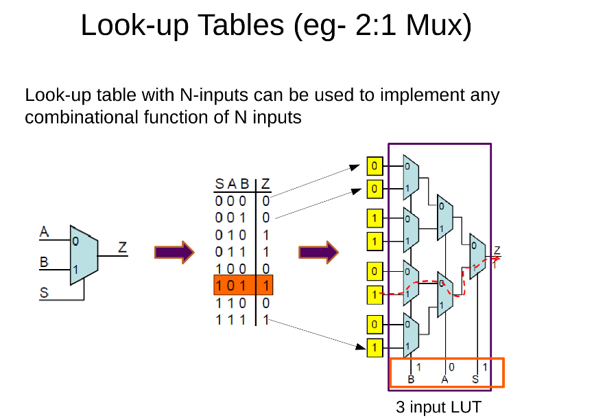

#### FPGA Design Methodology:

Below diagram shows all the steps involved in implementing a design on FPGA

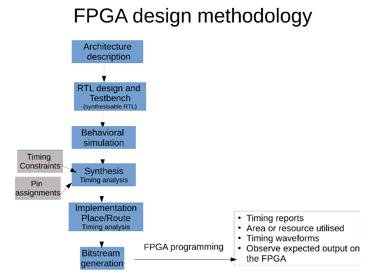

For the Lab we will be using Basys3 board. Below figure shows the different part of this board:

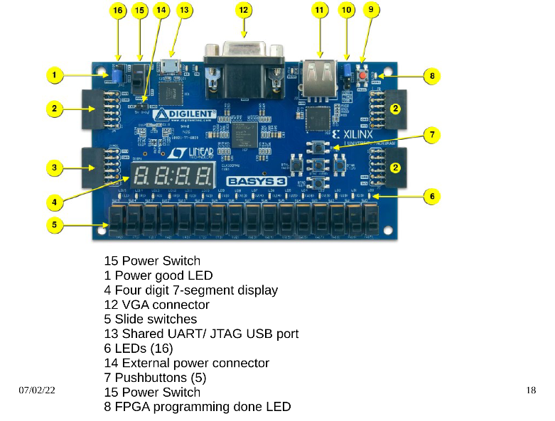

To download the Software and board related files go to sub-module directory and see slide no. 19

### Day 1 Lab:

Vivado Tutorial:

* Invoke vivado

Creating New Project:

* On first screen:
    * click on create new project
    * give project name
    * set the project working directory
    * click next
* Set the board. If the board files are installed then just you can search it using board name other wise select appropriate category then board number to specify the board. Click next
* On left side there is window of `project summary`
* On right side there is window of `project management`

Adding RTL and Testbench:

* To add the RTL files, click on `Add Source` in `project management` window. This will pop up new window, choose `Add or create design source` option and cick next. Point it to RTL files and click `add`. Make sure to choose all the option. Click finish. Under Project Management Window on right side, there is source window, the added files will appera there.
* Follow the above step to add test bench but make sure to select `add or create simulation source` this time.

Running Simulation:

* To run the simulation, click on `Run Simulation` in `Flow Navigator` window on right side. 
Following waveform can be observed in simulation:

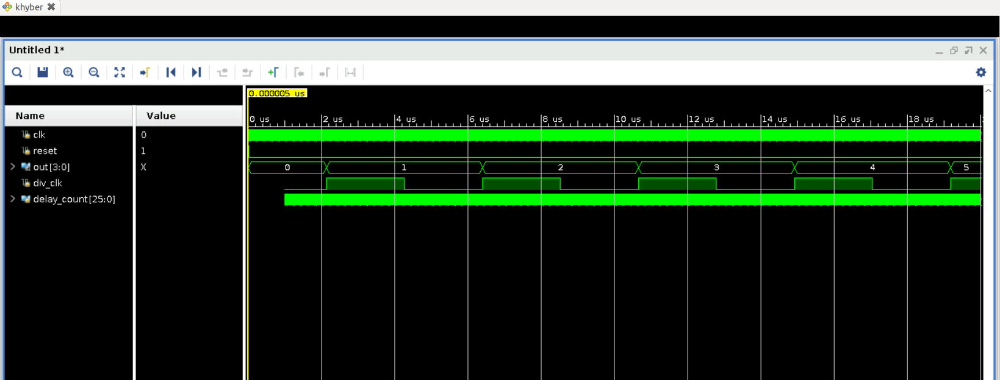

Elaborating Design:

To elaborate the design, click on `Open Elaborated Design` in Flow Navigator window. Once the elaboration is done, click on schematic to view how the design is implemented. For the current counter design, schematic looks like as shown below:

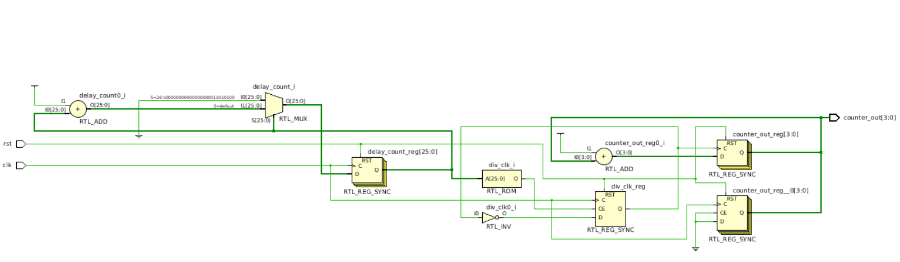

Similary on top right corner there is box to change the view. Set it to I/O Planning to see the I/O of board as shown in below fig:

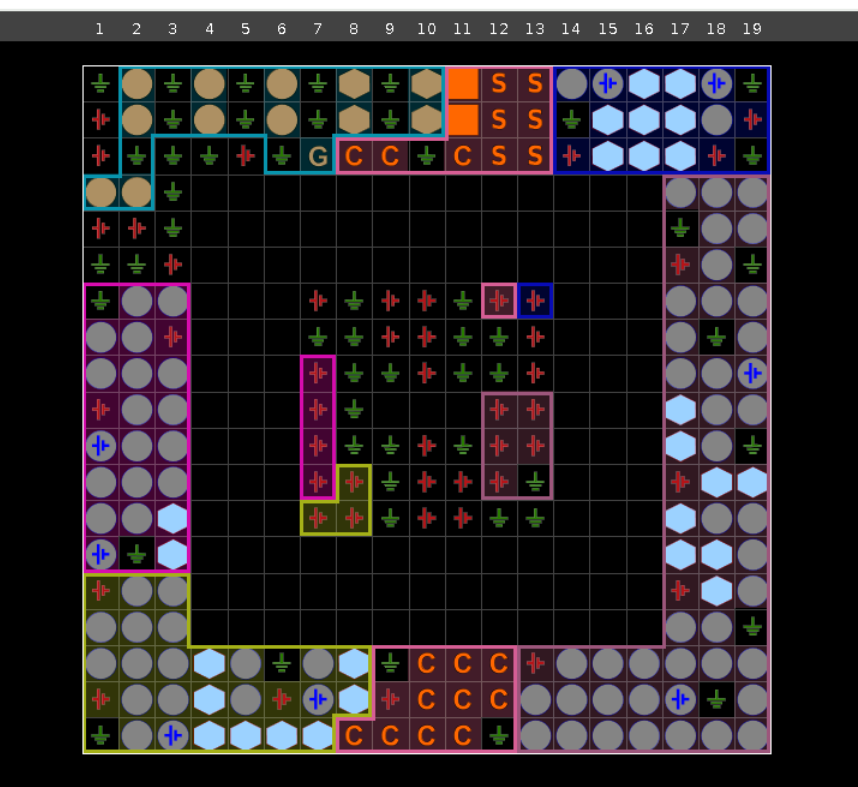

To map the I/O, either look at the data sheet of board or on actual board to find the pin number. On Vivado software, set the clock, reset button and output LEDs. Save it as constraint file. 
Slack means the time difference between the data required time and data arrival time.

Synthesis:

In Flow Navigator window, click on synthesis to synthesis the design. This will synthesis the design. Looking at the timing report indicate us it is not reporting the slack value. That's because we have not given it the clock frequency. To add actual timing we need to provide the clock frequency which can be done using the `Constraints Wizard` in Flow Navigator or using the TCL command in XDC file. Once providing the clock frequency, synthesis the design again. After this, synthesising it again, the schematic will look like as shown below:

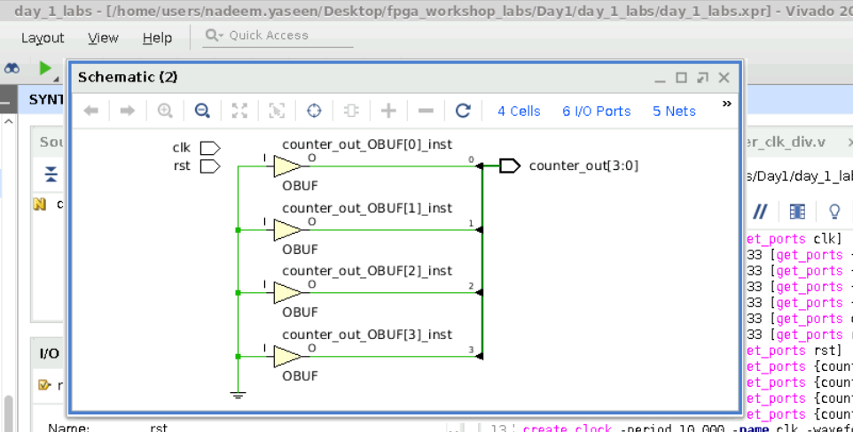

Now looking at timing report, it will show us that slack is positive. So we can move to implementation and then generate the bitstream. Once the bitstream is generated, click on `Open Hardware Manager` then on top a pop is shown about `Open target`, click on it and it will detect the board automatically if it is connected. 
Apart from timing report, other reports can also be viewed.

VIO (Virtual Input and Output):

When we do not have physical access to Xilinx board then VIO can be used to provide the input and observe the output. The input of RTL design will be given as output of VIO and output of RTL design are the input of VIO. Follow last slide to generate the IP in Vivado and do the code modification.Generate the bitstream, load it using Hardware Manager. Now use VIO to provide the input.

## Day 2:

OpenFPGA

OpenFPGA is an open source frame work to generate the custom FPGA fabric. It is needed as the generation of fabric need a lot of human resources and others. OpenFPGA architectures are in .xml form, example can be seen [here](https://github.com/lnis-uofu/OpenFPGA/blob/master/openfpga_flow/openfpga_arch/k6_N10_40nm_openfpga.xml). 

VTR 

It is an integration of various open source tools. This flow also takes the custom .xml based architecture and design file to implement the design on given architecture. Below diagram shows the different tools integrated in VTR flow:

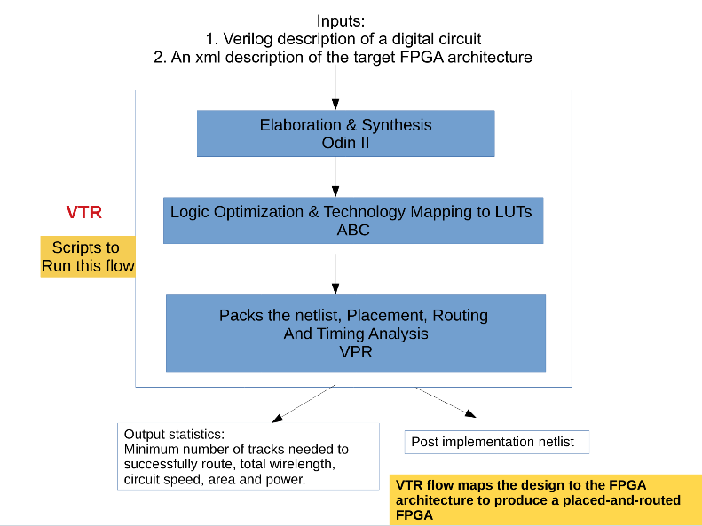

The documentation to start with VPR can be found [here](https://docs.verilogtorouting.org/en/latest/quickstart/)
The details about the different parts of FPGA architecture .xml file for VTR can be found [here](https://docs.verilogtorouting.org/en/latest/arch/reference/) 

Running only VPR in VTR:

Suppose we already have synthesised netlist then we can run the place and route on it with given architecture using VPR tool as fellow:

* Install the VTR. Follow [this guide](https://docs.verilogtorouting.org/en/latest/quickstart/) to install the VTR and set the necessary environmental variables.
* Invoke the VPR (versatile place and route) tool inside the VTR flow with the example BLIF and Earch file with command shown below:

```bash
$ $VTR_ROOT/vpr/vpr \
    $VTR_ROOT/vtr_flow/arch/timing/EArch.xml \
    $VTR_ROOT/vtr_flow/benchmarks/blif/tseng.blif \
    --route_chan_width 100
    --disp on
```

Different view can be seen below:

|              VPR Nets view         |              VPR Logical Connections view      |   VPR Congested Layout View    |
|------------------------------------|----------------------------------------------|-----------------|
| 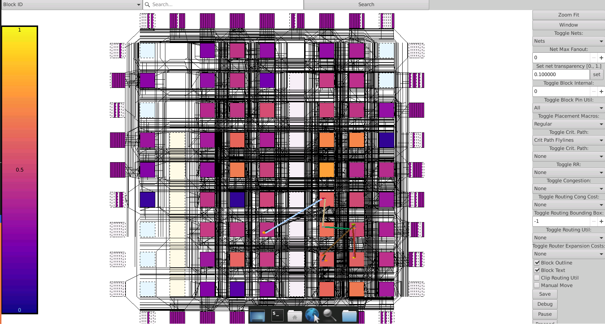 | 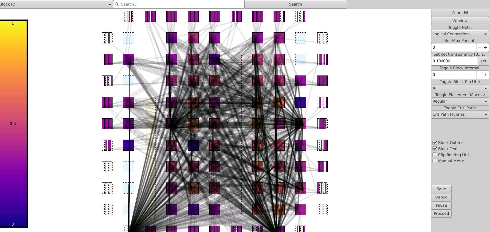 | 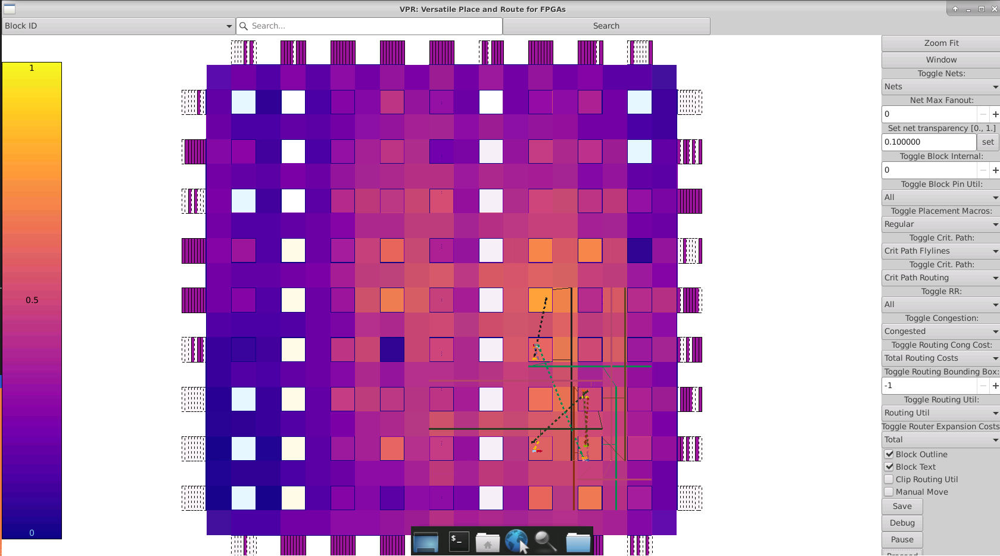 |


In the directory where VPR is invoked following reports can be found:

* *.net -> This is a .xml file which has the post packed circuit. It shows the user netlist maped on given architecture.
* *.place -> This shows the placement of netlist.
* *.route -> This shows how the different nets are interconnected.
* *.log  -> Log file showing the details that were printed on terminal.

Apart from each step log, VPR also dump the report of each step e.g. setup_timing report, hold timing report etc. This report tell us that either we have met the slack or not. 

Running whole VTR flow:

To run the entire flow i.e. from synthsis till the end is done using the VTR flow using the command explained [here](https://docs.verilogtorouting.org/en/latest/quickstart/#automatically-running-the-vtr-flow)

```bash

$VTR_ROOT/vtr_flow/scripts/run_vtr_flow.py \
    $VTR_ROOT/doc/src/quickstart/counter.v \
    $VTR_ROOT/vtr_flow/arch/timing/EArch.xml \
    -temp_dir . \
    --route_chan_width 100

```

**Note:** The `counter.v` file is in Day2 folder of submodule. So make sure to give correct path.

This command generates all the VPR output as well as pre and post synthesis netlist.

To run the post implementation netlist simulation on Vivado do the below steps:

* Generate the the Post-Implementation Netlist using command explained [here](https://docs.verilogtorouting.org/en/latest/tutorials/timing_simulation/#generating-the-post-implementation-netlist). Change the command as shown below 

```bash
$VTR_ROOT/vpr/vpr $VTR_ROOT/vtr_flow/arch/timing/EArch.xml counter.pre-vpr.blif --gen_post_synthesis_netlist on
```

This will generate the `up_counter_post_synthesis.v` and `up_counter_post_synthesis.sdf`. To understand the inside of this file follow the above link.

* Create a new project in Vivado. Choose any device as we are going to do just the simulation. Add the `up_counter_post_synthesis.v` generated in previous step and `$VTR_ROOT/vtr_flow/primitives.v` files as RTL source and testbecnh `counter_tb.v` in day2 folder of submodule as simulation source. Once added, running the simulation will show the waveform like below:

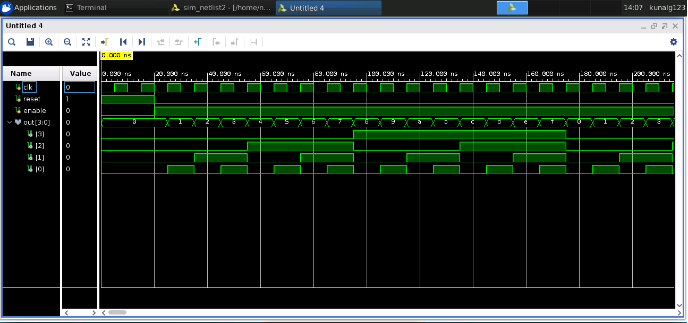

**Note:** In `counter_tb.v` make sure to provide the path of `.sdf` generated by you. In `$VTR_ROOT/vtr_flow/primitives.v`, inside the `DFF` module change the clock name from `clk` to `clock`. In `up_counter_post_synthesis.v` on line number 412 and 451, it is assigning X to `sumout` and `cout`, replace it with dummy and on line 410 it is assigning 0 to `cin` replace it with 0.

The timing related reports can found in current working directory under the name `report_timing.hold.rpt` and `report_timing.setup.rpt`. If no `sdc.` file is given the slack will not met. The `.sdc` file can be given in VPR option using flag `--sdc_file`. The are utilization related information is in `vtr_stdout.log` file. To do the powe analysis, run the command as given below:

```bash

$VTR_ROOT/vtr_flow/scripts/run_vtr_flow.py \
    $VTR_ROOT/doc/src/quickstart/counter.v \
    $VTR_ROOT/vtr_flow/arch/timing/EArch.xml \
    -temp_dir . \
    -power -cmos_tech $VTR_ROOT/vtr_flow/tech/PTM_45nm/45nm.xml \
    --route_chan_width 100

```
This will generate the power report with extension `.power`. This report has all the information about the consumption of power by different components.

## Day 3:

To implement the RISCV Mythcore (link [hrer](https://github.com/shivanishah269/risc-v-core)), choose the the verilog file containing the code of entire core. Create a new project in vivado and add the `mythcore_test.v` as verilog file source and `test.v` as simulation source. Mythcore is a pipe line processor. Initially the memory was loaded to sum the first 9 numbers. Once the files are added to Vivado and running the simulaiton, the sum 45 can be seen on wavform as shown below:

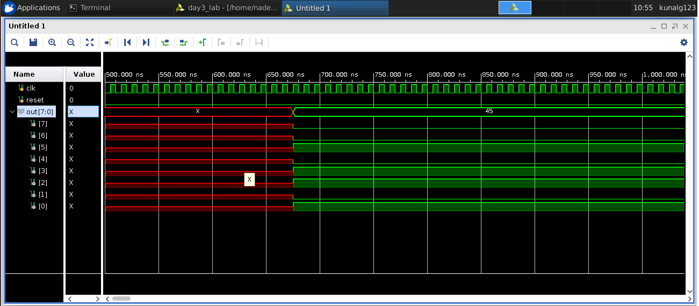

Running the elobration step following schematic can vbe seen:

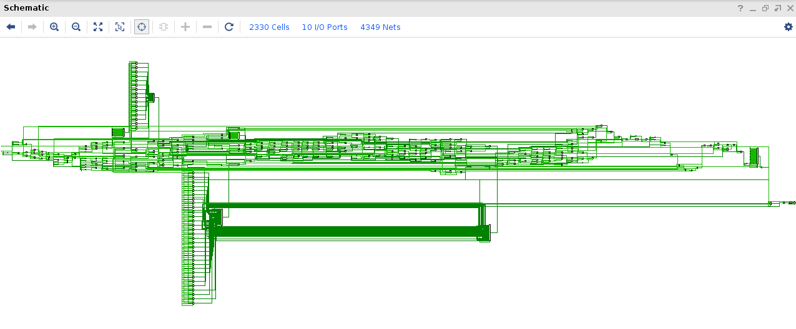

Now to the run the flow till bitstream and use the ILA (integrated logic Analyser), remove the output port, generate the ILA IP from Xilinx IP catalog and instantiate it to observe the output. Run the synthesis and add the timing and Pin constraints file. Make sure slack is positive by viewing the timing summary. Run the implementation and observe the implemented design as shown below:

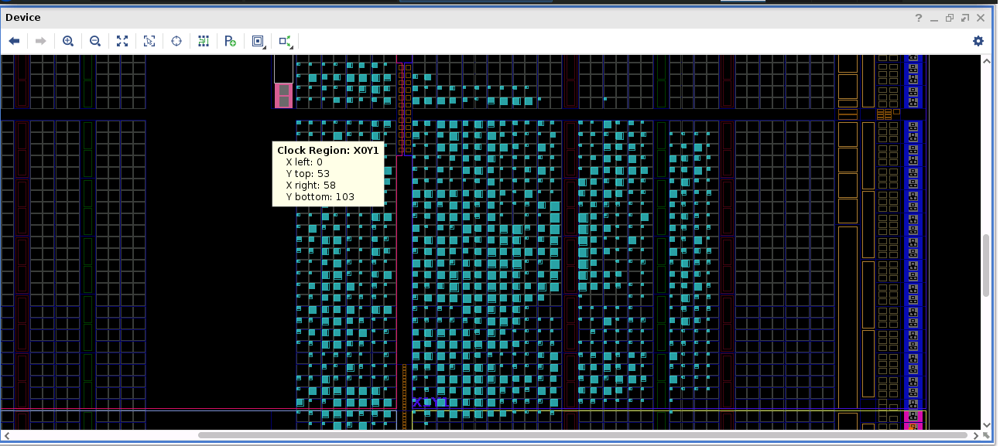

And the utilization of various components can be as follow:

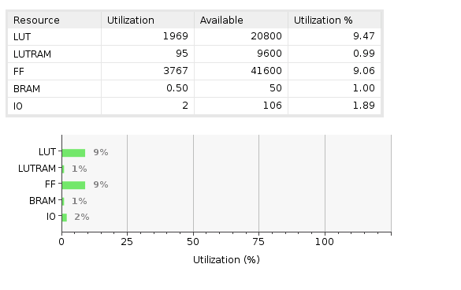

## Day 4:

SOFA ([Skywater Opensource FPGAs](https://github.com/lnis-uofu/SOFA)) are a series of open source FPGA IPs using the open source skywater 13nm PDK and OpenFPGA framework. We will take `counter.v` as example verilog design and pass it through the SPFA flow open source architecture. Using the quick start guide given on SOFA repo, modify the task config file to point to counter.v design file. and run the flow. File `vpr_stdout.log` shows the information about utilization as fellow:

```
Circuit Statistics:
  Blocks: 30
    .input :       2
    .latch :       8
    .output:       8
    4-LUT  :      12
  Nets  : 22
    Avg Fanout:     2.9
    Max Fanout:     8.0
    Min Fanout:     1.0
  Netlist Clocks: 1

```
```
Pb types usage...
  inpad        : 2
  outpad       : 8
  lut4         : 4
  ble4         : 4
  ff           : 8
  fle          : 11
  clb          : 2
  lut3inter    : 7
  ble3         : 8
  io           : 10
  lut3         : 8
  lut          : 12

```
This run does not contain the timing information as we have not given the SDC constraint file. The SDC constraints file will be given to VPR tool and following slac information is observed.

* For setup timing:

```
‌‌clock clk (rise edge)                                           35.000    35.000
clock source latency                                             0.000    35.000
clk.inpad[0] (.input)                                            0.000    35.000
q[6].clk[0] (.latch)                                             0.110    35.110
clock uncertainty                                                0.000    35.110
cell setup time                                                 -0.390    34.720
data required time                                                        34.720
--------------------------------------------------------------------------------
data required time                                                        34.720
data arrival time                                                        -25.920
--------------------------------------------------------------------------------
slack (MET)                                                                8.800

```

* For hold timing

```
clock clk (rise edge)                                            0.000     0.000
clock source latency                                             0.000     0.000
clk.inpad[0] (.input)                                            0.000     0.000
q[1].clk[0] (.latch)                                             0.000     0.000
clock uncertainty                                                0.000     0.000
cell hold time                                                   0.390     0.390
data required time                                                         0.390
--------------------------------------------------------------------------------
data required time                                                        -0.390
data arrival time                                                          4.170
--------------------------------------------------------------------------------
slack (MET)                                                                3.780
``` 

Below is the power statistics:

## Day 5:

On day 5, the RISCV core RVMyth is implemented on the open source architecture using the SOFA. Following figures shows the utilization:

```
Pb types usage...
  inpad        : 2
  outpad       : 8
  shift_reg    : 3
  lut4         : 3031
  ble4         : 3031
  ff           : 1807
  fle          : 3477
  clb          : 447
  lut3inter    : 443
  ble3         : 663
  io           : 10
  lut3         : 648
  lut          : 3679


Logic Element (fle) detailed count:
  Total number of Logic Elements used : 3477
  LEs used for logic and registers    : 1741
  LEs used for logic only             : 1732
  LEs used for registers only         : 4

```
To get the timing information, SDC file is passed. Below figures shows that slack is met

Hold timing:

```
clock clk (rise edge)                                            0.000     0.000
clock source latency                                             0.000     0.000
clk.inpad[0] (.input)                                            0.000     0.000
CPU_is_bltu_a3.clk[0] (.latch)                                   0.000     0.000
clock uncertainty                                                0.000     0.000
cell hold time                                                   0.390     0.390
data required time                                                         0.390
--------------------------------------------------------------------------------
data required time                                                        -0.390
data arrival time                                                          1.350
--------------------------------------------------------------------------------
slack (MET)                                                                0.960
```

Setup timing:

```
clock clk (rise edge)                                          200.000   200.000
clock source latency                                             0.000   200.000
clk.inpad[0] (.input)                                            0.000   200.000
CPU_Xreg_value_a4[22][31].clk[0] (.latch)                        0.110   200.110
clock uncertainty                                                0.000   200.110
cell setup time                                                 -0.390   199.720
data required time                                                       199.720
--------------------------------------------------------------------------------
data required time                                                       199.720
data arrival time                                                       -192.180
--------------------------------------------------------------------------------
slack (MET)                                                                7.540
```

## Acknowledgement:

Thankfull to Mr. Kunal for arranging the workshop and Mam Nanditha Rao.

# Note:

The work is still under progress.